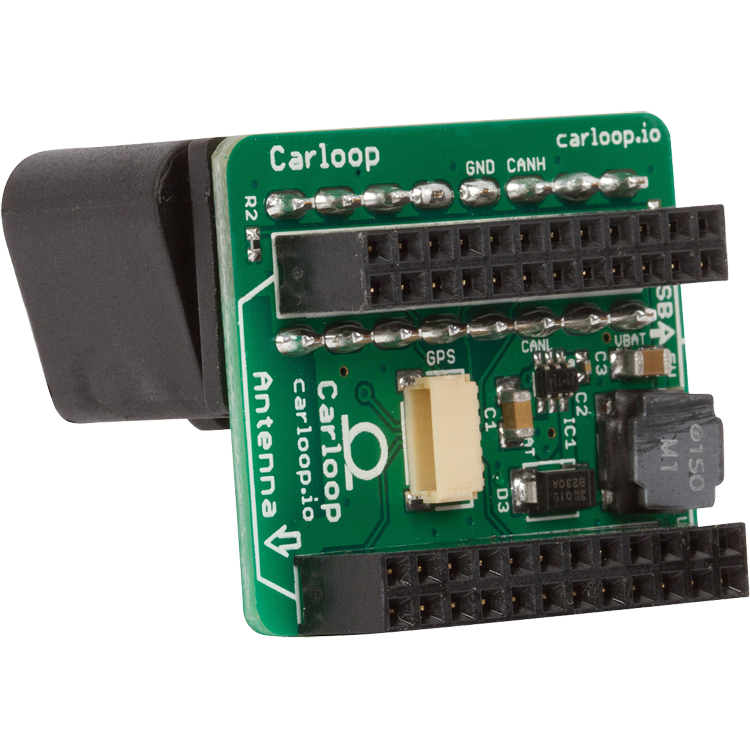
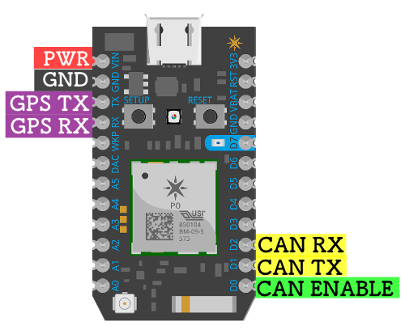

# [Carloop](https://www.carloop.io)
## OBD-II CAN adapter for the Particle Photon/Electron and RedBear Duo

The WiFi-capable Particle Photon or better yet the cellular Particle
Electron can turn your car into a cloud connected device!

Carloop's PCB connects your car's CAN bus network to the Photon, Electron and Duo. It also provides battery power and a GPS to track location.

# Particle Photon Example

# [Check out the Carloop Store](https://store.carloop.io/)

## Features

* High-speed CAN transceiver [adapted from the OpenXC project](https://github.com/openxc/reference-vi/blob/gh-pages/electrical/design/can.mkd)
* Get power from the OBD-II port using [a robust circuit adapted from the OpenXC project](https://github.com/openxc/reference-vi/blob/gh-pages/electrical/design/power.mkd)
* GPS connector
* Stacked components for a more compact development kit than a
traditional 90-degrees PCB mount OBD-II connector.
* Powered by the Particle platform!

## Images

PCB

Assembled adapter

* [With Photon](images/detail-photon.jpg)
* [With Electron](images/detail-electron.jpg)
* [Front view](images/front.png)
* [Side view](images/detail-side.jpg)
* [Back view](images/back.png)
* [Angle view](images/angle.png)

## Hardware

Here are the PCB design files for the Revision 2.1

* [Schematic (PDF)](Carloop.v2/carloop-v2.1.pdf)
  [(Eagle)](Carloop.v2/carloop-v2.1.sch)
* [Layout (top)](Carloop.v2/carloop-v2.1-layout-top.pdf)
  [(bottom)](Carloop.v2/carloop-v2.1-layout-bottom.pdf)
  [(Eagle)](Carloop.v2/carloop-v2.1.brd)
* [Bill of materials](carloop-v2.1_BOM.csv)
* [OSH Park order page](https://oshpark.com/shared_projects/ir8I9vT6)

## Software

The [Carloop Library](https://github.com/carloop/carloop-library) is available on Particle's Web IDE.  You will need to flash a [Particle Photon](https://store.carloop.io/products/particle-photon), [Particle Electron](https://store.carloop.io/products/particle-electron) or [RedBear Duo](https://store.carloop.io/products/redbear-duo) with an example app which can ben found in Carloop Library.   See 'Getting Started' instructions here: [https://community.carloop.io/t/getting-started-with-carloop/23](https://community.carloop.io/t/getting-started-with-carloop/23)

## License

Copyright 2016 1000 Tools, Inc.

Licensed under the GPL v3
